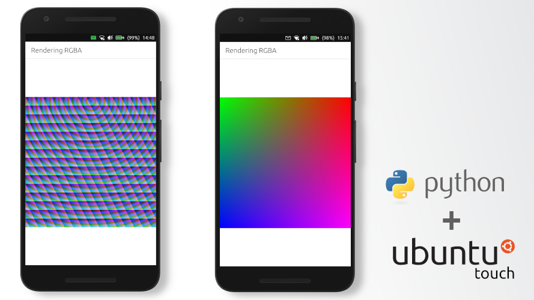

# Create RGBA Image with Python on Ubuntu Touch
[[статья на русском]](http://dtc1.ru/Создание%20RGBA%20изображения%20при%20помощи%20Python%20на%20Ubuntu%20Touch)
**Let's create a new project in Clickable**, enter the command in the terminal:
    
    clickable create
	
Select the Python project type and fill in:
Title \[App Title\]: Rendering RGBA  
App Name \[appname\]: example-RGBA

Delete the Python object in the Main.qml file, and convert the Page object to the form:

    Page {
            anchors.fill: parent
            header: PageHeader {
                id: header
                title: i18n.tr('Rendering RGBA')
            }
    
            Image {
            id: image
            fillMode: Image.PreserveAspectFit
            anchors {
                top: header.bottom
                left: parent.left
                right: parent.right
                bottom: parent.bottom
            }
    
                Python {
                    Component.onCompleted: {
                    addImportPath(Qt.resolvedUrl('../src/'));
                    importModule('example', function () {
                        image.source = 'image://python/image-id-passed-from-qml';
                    });
                    }
    
                    onError: console.log('Python error: ' + traceback)
                }
            }
        }
		
Thus, on the **Page** we created the **Image** object.
To **Image** a Python code processing object ** was created, which will fire when **initialized**  and return the **render image**.

Now select the project, find the src directory and change *example.py*.

    import pyotherside
    import math

    def render(image_id, requested_size):
        print('image_id: "{image_id}", size: {requested_size}'.format(**locals()))

        # width and height will be -1 if not set in QML
        if requested_size == (-1, -1):
            requested_size = (300, 300)

        width, height = requested_size

        # center for circle
        cx, cy = width/2, 10

        pixels = []
        for y in range(height):
            for x in range(width):
                pixels.extend(reversed([
                    255, # alpha
                    int(10 + 10 * ((x - y * 0.5) % 20)), # red
                    20 + 10 * (y % 20), # green
                    int(255 * abs(math.sin(0.3*math.sqrt((cx-x)**2 + (cy-y)**2)))) # blue
                ]))
        return bytearray(pixels), (width, height), pyotherside.format_argb32

    pyotherside.set_image_provider(render)

**pyothersid** allows our code to create and return QML objects.
So render will return us a byte image in **format_argb32** format.
During function, we create a two-dimensional array of pixels-bytes. Each element contains 4 bits - Alpha transparency (*0-255*), the value of red (*0-255*), green (*0-255*) and blue (*0 -255*).
Use mathematical calculations, we can generate textures and edit images.

All that remains for us is to open a terminal in the project folder, connect the phone and start compilation with the command:

    clickable
	

**P.S.** another gradient generation function:

    def render(image_id, requested_size):
        print('image_id: "{image_id}", size: {requested_size}'.format(**locals()))

        # width and height will be -1 if not set in QML
        if requested_size == (-1, -1):
            requested_size = (300, 300)

        width, height = requested_size

        pixels = []
        for y in range(height):
            for x in range(width):
                pixels.extend(reversed([
                    255, # alpha
                    int(round(255/width*x)), # red
                    int(round((255-255/width*x)*(1-y/width))), # green
                    int(round(255/height*y)) # blue
                ]))
        return bytearray(pixels), (width, height), pyotherside.format_argb32